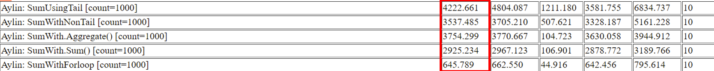

## Tool for doing MicroBenchmarks for .Net

During the last term, when we were implementing many functions and doing our programming homework for DataStructure course, we faced with the below error for several times. 
```c#
Error Message:
    Test '###' exceeded execution timeout period.
```
Which means that the code is using more time than what is specified. We have asked this question for many times, that "why this code has less execution time than the other?" or vice versa.<br />
In the previous session of Design and Analysis of Algorithms course, we have been introduced a new tool, which helps us to calculate the time of different algorithms. This tool has been impelemented by Mr. Vance Morrison.<br />
The main purpose of this project, is to compare the performance of different codes, and finally how to improve and make our code better. 

***
### The first assumption(mine)

My idea was to check the different ways for calculateing the sum of elements in an array. I've checked it using the following different methods:
- Recursion
    - with tail
    - without tail
- for
- LINQ
    - .Aggregate()
    - .Sum()
<br />
And here are my codes:
```c#
    public static int sumWithTailRecursion(int[] myArray, int length, int sum)
    {
        if (length <= 0)
        {
            return sum;
        }
        return sumWithTailRecursion(myArray, length - 1, sum + myArray[length - 1]);
    }
    public static int sumWithRecursion(int[] myArray, int length)
    {
        if (length <= 0)
        {
            return 0;
        }
        return sumWithRecursion(myArray, length - 1) + myArray[length - 1];
    }
    public static void MeasureAylin()
    {
        int sum = 0;
        int[] myArray = new int[1000];
        int length = myArray.Length;
        timer1000.Measure("SumUsingTail", delegate{
            int res1 = sumWithTailRecursion(myArray, length, sum);
        });
        timer1000.Measure("SumWithNonTail", delegate{
            int res2 = sumWithRecursion(myArray, length);
        });
        timer1000.Measure("SumWith.Aggregate()", delegate{
            int res3 = myArray.Aggregate((ele1, ele2) => ele1 + ele2);
        });
        timer1000.Measure("SumWith.Sum()", delegate{
            int res4 = myArray.Sum();
        });
        timer1000.Measure("SumWithForloop", delegate{
            for (int i = 0; i < length; i++)
            {
                sum += myArray[i];
            }
        });
    }
```
And here is the final result(the colored columne showes the average time which has been use foreach algorithm):


***
### The second assumption(Aysa)

### The third assumption(Golbarg)
### The forth assumption(Melika)
### The fifth assumption(Zahra)


***
Here is a [link](https://docs.microsoft.com/en-us/archive/blogs/vancem/measureit-update-tool-for-doing-microbenchmarks-for-net) to the main blogpost. You can also download the source codes from [here](http://filedropper.com/6cv5M5Bl).
