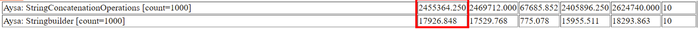
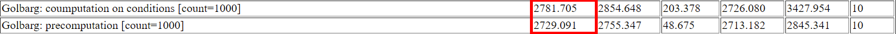
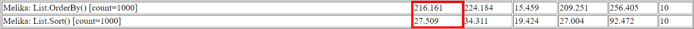
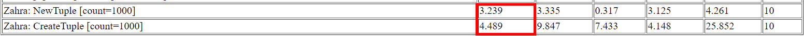

## Tool for doing MicroBenchmarks for .Net

During the last term, when we were implementing many functions and doing our programming homework for DataStructure course, we faced with the below error for several times. 
```c#
Error Message:
    Test '###' exceeded execution timeout period.
```
Which means that the code is using more time than what is specified. We have asked this question for many times, that "why this code has less execution time than the other?" or vice versa.<br />
In the previous session of Design and Analysis of Algorithms course, we have been introduced a new tool, which helps us to calculate the time of different algorithms. This tool has been impelemented by Mr. Vance Morrison.<br />
The main purpose of this project, is to compare the performance of different codes, and finally how to improve and make our code better. 

***
### The first assumption(mine)

My idea was to check the different ways for calculateing the sum of elements in an array. I've checked it using the following different methods:
- Recursion
    - with tail
    - without tail
- `for`
- LINQ
    - `.Aggregate()`
    - `.Sum()`

<!-- end of the list -->

And here are my codes:
```c#
public static int sumWithTailRecursion(int[] myArray, int length, int sum)
{
    if (length <= 0)
    {
        return sum;
    }
    return sumWithTailRecursion(myArray, length - 1, sum + myArray[length - 1]);
}
public static int sumWithRecursion(int[] myArray, int length)
{
    if (length <= 0)
    {
        return 0;
    }
    return sumWithRecursion(myArray, length - 1) + myArray[length - 1];
}
public static void MeasureAylin()
{
    int sum = 0;
    int[] myArray = new int[1000];
    int length = myArray.Length;
    timer1000.Measure("SumUsingTail", delegate{
        int res1 = sumWithTailRecursion(myArray, length, sum);
    });
    timer1000.Measure("SumWithNonTail", delegate{
        int res2 = sumWithRecursion(myArray, length);
    });
    timer1000.Measure("SumWith.Aggregate()", delegate{
        int res3 = myArray.Aggregate((ele1, ele2) => ele1 + ele2);
    });
    timer1000.Measure("SumWith.Sum()", delegate{
        int res4 = myArray.Sum();
    });
    timer1000.Measure("SumWithForloop", delegate{
        for (int i = 0; i < length; i++)
        {
            sum += myArray[i];
        }
    });
}
```
The final result(the colored columne showes the average time which has been use foreach algorithm):

The strange thing is that by using the tail-recursive function, time was not decreased. This link shows that actually there is not much difference between these 2 kindes of recursions, but tail recursion seems to be worse. Base on this [link](https://www.baeldung.com/cs/tail-vs-non-tail-recursion), there are two problems for non-tail recursion function.

> The first issue is that we risk a stack overflow. If the recursion is too deep, it will eventually run out of the stack
> space and be unable to add a new frame. This scenario plays out in the case of inputs that are too large.<br/>
> The second is that calculation starts from the base case, and we traverse the whole array to reach it. During that 
> pass, we don’t do any calculations. Only after hitting the base case can we start adding the array’s elements to one 
> another. We do so by going back to the first call. So, we pass the input array twice instead of once.

<!-- end of the quote -->
Now if we want to talk about LINQs. Sometimes they can be really helpful and easy to read, but it can not always make the performance better. And if we don't know the implementation of a LINQ function, so maybe it is better not to use it. For example in this simple algorithm, a simple `for` loop works much faster than `.Sum()` and `.Aggregate()` mehtods. Also the difference between these 2 LINQ methods, can be because of their structure. Every time that `.Aggregate()` is called two variables(like `ele1` and `ele2`) must be passed to it.

***
### The second assumption(Aysa)
Aysa's idea was to calculate the difference between using `StringBuilder` and `string` `classes`, for adding characters to an string. In the first `delegate` she used `+` operator to add a character to `s`. And in the second `delegate`, she created an object of `StringBuilder` then by calling the predefined function, `.Append()`, a new character would be added. 
Here are her codes:
```c#
public static void MeasureAysa()
{
    timer1000.Measure("StringConcatenationOperations", delegate
    {
        string s = "x";
        for (int i = 0; i < 10000; i++)
        {
            s += "a";
        }
    });

    timer1000.Measure("Stringbuilder", delegate
    {
        StringBuilder sb = new StringBuilder("x");
        for (int i = 0; i < 10000; i++)
        {
            sb.Append("a");
        }
    });
}
```
The final result(the colored columne showes the average time which has been use foreach algorithm):

There is a vast difference between the amount of times in this 2 cases, and obviously `StringBuilder` is better. For example in her example, which has a `for` loop with 1000 iterations, a plenty of memory and time is used, in the other words it means that a lot of strings have been allocated and discarded.<br/>
This [link](https://stackoverflow.com/questions/1972983/string-concatenation-vs-string-builder-append) has a good explanation for its reason. 
> Strings are immutable. String concatenation creates a new string, needing more memory, and is generally considered slow.
> On the other hand, StringBuilder is designed to be appended, removed, etc.

<!-- end of aysa first quote -->

Also this [link](https://www.infoworld.com/article/3616600/when-to-use-string-vs-stringbuilder-in-net-core.html#:~:text=Note%20that%20regular%20string%20concatenations,string%20concatenations%2C%20use%20a%20string.&text=In%20short%2C%20use%20StringBuilder%20only%20for%20a%20large%20number%20of%20concatenations.) provides more explanation about `StringBuilder` in .Net:
> StringBuilder is an example of a mutable item. In C#, a StringBuilder is a mutable series of characters that can be
> extended to store more characters if required. Unlike with strings, modifying a StringBuilder instance does not result
> in the creation of a new instance in memory.<br/>
> When you want to change a string, the Common Language Runtime generates a new string from scratch and discards the old 
> one. So, if you append a series of characters to a string, you will recreate the same string in memory multiple times. 
> By contrast, the StringBuilder class allocates memory for buffer space and then writes new characters directly into the
> buffer. Allocation happens only once.

***
### The third assumption(Golbarg)
Golbarg's idea was to the check whether it is better to precompute the values of conditions or not. She first has implemented a `point` class, then in a `for` loop, has initialized an array of points. In other `for` loop there is a simple `if` condition. The difference between these 2 codes is in `min` variable.
```c#
public struct point{
    public int X;
    public int Y;
    public point(int x , int y)
    {
        X = x;
        Y = y;
    }
}
public static void MeasureGolbarg()
{
    point[] points = new point[100];
    double min = double.MaxValue;
    Random rnd = new Random();
    double pish = 0;
    for(int i = 0;i< 100;i++)
    {
        points[i] = new point(rnd.Next(-10,10),rnd.Next(-10,10));
    }
    timer1000.Measure("coumputation on conditions", delegate
    {
        for(int i=1; i<100; i++)
        {
            if(Math.Sqrt(Math.Pow((points[i].X - points[i-1].X),2) + Math.Pow((points[i].Y - points[i-1].Y),2)) < min){
                min = Math.Sqrt(Math.Pow((points[i].X - points[i-1].X),2) + Math.Pow((points[i].Y - points[i-1].Y),2));
            }
        }
    });
    min = double.MaxValue;
    timer1000.Measure("precomputation", delegate
    {
        for (int i = 1;i< 100; i++)
        {
                pish = Math.Pow((points[i].X - points[i-1].X),2) + Math.Pow((points[i].Y - points[i-1].Y),2) ;
                if(pish < min)
                {
                    min = pish;
                }
        }
    });
}
```
The final result(the colored columne showes the average time which has been use foreach algorithm):

There is not much difference between these 2 values, but it shows that it is better to precompute the values outside of `if` condition.

***
### The forth assumption(Melika)
Melika's idea was to check 2 different LINQ methods for sorting a list and their running times:
- `.OrderBy()`
- `.Sort()`

<!-- end of the list -->

```c#
public static void MeasureMelika(){
    Random random = new Random();
    List<int> Nums1 = new List<int>();
    List<int> Nums2 = new List<int>();
    List<int> Nums3 = new List<int>();

    for(int i = 0; i < 10; i++){
        int num = random.Next(1, 1000);
        Nums1.Add(num);
        Nums2.Add(num);
    }

    timer1000.Measure("List.OrderBy()", delegate {
        IEnumerable<int> c =  Nums2.OrderBy(x => x);
        foreach(var i in c){ Nums3.Add(i); }
    });

    timer1000.Measure("List.Sort()", delegate {
        Nums1.Sort();
        foreach(var i in Nums1){ Nums3.Add(i); }
    });
    
    for(int i = 0; i < Nums3.Count; i++)
    {
        Nums3[i]++;
    }
}
```
The final result(the colored columne showes the average time which has been use foreach algorithm):

There is an important point about the first method. The output of `.OrderBy()` function is an `Enumerable`, and if we don't `Enumerate` the output(in this example `c`) the compiler may ignore it, and in other words the sorting algorithm won't be done completely.<br/>
And the other reason is that for `.OrderBy()` we must initialize it with a key(in this example `x`). And every time that `.OrderBy()` is called, the `delegate` will be called either.<br/>
But there is not such a thing in `.Sort()` function. The positive point is that, this method sorts our list ***in-place***. But `.OrderBy()` returns an another version of our list. So for see the correct result, it's better try to access the elements of both lists after sorting. For example in these 2 codes, she has written a `for` loop which increases each element of sorted lists.
And as it's shown in the picture, `.Sort()` function is better than the `.OrderBy()`.

***
### The fifth assumption(Zahra)
Zahra's idea was to check the difference between creating a new `Tuple`. She checked 2 ways. In the first algorithm, she used `new` keyword, but in the second one she used `.Create()`, which is a predefined function.
```c#
public static void MeasureZahra()
{
    timer1000.Measure("NewTuple", delegate
    {
        Tuple<int,int> t1 = new Tuple<int,int>(5, 3);
    });

    timer1000.Measure("CreateTuple", delegate
    {
        Tuple<int,int> t2 = Tuple.Create(1, 2);
    });
}
```
The final result(the colored columne showes the average time which has been use foreach algorithm):

As it is shown in the results, the first way is faster. Actually, there is not much difference between them, but as you can see, there is no need to pass the variable type in `.Create()` function.


***
Here is a [link](https://docs.microsoft.com/en-us/archive/blogs/vancem/measureit-update-tool-for-doing-microbenchmarks-for-net) to the main blogpost. You can also download the source codes from [here](http://filedropper.com/6cv5M5Bl).

***
Team members:
- Aysa Mayahi nia
- Melika Mohammadi fakhar
- Golbarg Sepehr ara
- Zahra Tabatabaee
- Aylin Naebzadeh
