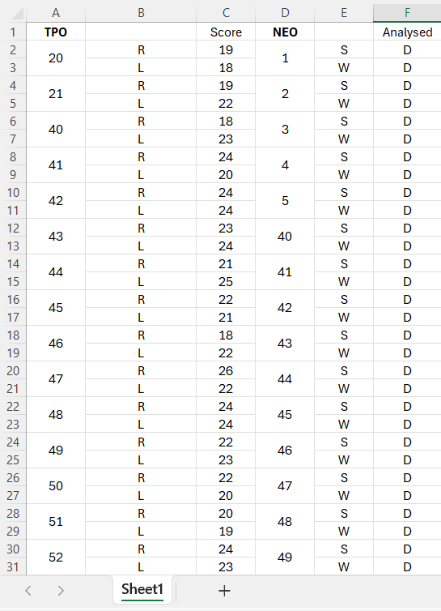

<h2 style="text-align: right; direction: rtl;">تجربیات من در آزمون تافل، نحوه آمادگی در دو ماه و منابع</h2>

در این پست قصد دارم تجربیات و نظرات خودم در طول دو ماهی که برای آزمون تافل داشتم بطور خلاصه توضیح بدهم.
من از حدود 20 تیر ماه و پس از آخرین ترم دانشگاهم زمان محدودی برای آزمونم که سوم شهریور بود، داشتم.
از اواخر اسفند ماه بود که تصمیم گرفتم در این آزمون شرکت کنم و اوایل اردیبهشت ماه ثبت نام رو انجام دادم و آزمونم رو در سنتر علامه سخن واقع در میدان آرژانتین تهران رزرو کردم. چون کمی هم دیر بود سنترهایی مثل خاتم و اندیشه معین پر شده بودن و برای هفته اول شهریور که من میخواستم ظرفیت نداشتن..

قبل از هر نکته‌ای می‌خواستم این رو هم بگم که این‌ها نظرات شخصی من هستند و ممکن هم هست که درست نباشند و یک نکته مهم که وجود داره این هست که در بحث یادگیری هر زبانی واقعا نمیشه یک نسخه برای همه پیچید. 

من از زمانی که 12 سالم بود کلاس زبان عمومی می‌رفتم ولی چون برای آزمون زمان محدودی داشتم فرصت کلاس و معلم و ... هم نبود. و همانطور که از تجربیات خیلیا شنیده بودم الان با وجود منابعی مثل یوتیوب و اینترنت واقعا شاید کلاس خیلی برای افرادی که سطح زبان متوسط رو به بالا دارند مفید نباشه و بیشتر موجب اتلاف وقت بشه. در ادامه نکاتم رو مورد به مورد بیان میکنم و امیدوارم  که برای شما نیز مفید باشند.

<h3 style="text-align: right; direction: rtl;">منابع</h3>

اصلی‌ترین منبعی که من داشتم سایت <a href="https://toefl.testhelper.ir/" style="text-align: right; direction: rtl;">testhelper </a> بود که نزدیک به 300 آزمون تافل مربوط به سال‌های گذشته رو داره. وقتی وارد سایت بشید سه بخش tpo، neo و zhenti رو مشاهده می‌کنید. من به دلیل کمبود وقت بخش خوانش و شنیداری رو از tpo و دو بخش دیگه رو از neo کار می‌کردم. چون طبق تجربیاتی که از بقیه داشتم tpoها منابع خوبی برای تمرین بودند.
دررابطه با فرمت آزمون و استراتژی‌های آزمون یکسری فیلم در حد 5 ساعت از <a href="https://www.youtube.com/results?search_query=tst+prep+toefl" style="text-align: right; direction: rtl;">کانال یوتیوب TST Prep </a> و magoosh دیدم.
اما مهم‌ترین منبعی که داشتم تجربیات دوستان عزیزم در گروه تلگرام <a href="https://t.me/joinchat/4wCvSfh7h81hNzU0" style="text-align: right; direction: rtl;">TOEFL Preparation</a> بود.

<h3>Reading</h3>

برای بخش خوانش و شنیداری مهم‌ترین کار تمرین، تمرین و تمرین هست. من هر روز سعی می‌کردم هر چهار مهارت رو کار کنم. البته بعد از هر بخش تحلیل می‌کردم. تحلیل مهم‌ترین بخش هست و اهمیتش خیلی بیشتر از تعداد آزمون‌هایی هست که می‌زنید. اوایل خیلی سخت بود و نمراتم از حدود ۱۸/۱۹ بودن ولی در ادامه به ۲۵/۲۶ رسیدم. مهم‌ترین نکته ناامید نشدن و ادامه تمرین بود. همه ما در یک مسیر هستیم و این تمرین‌ها هیچ کدوم آخر مسیر نیستن. یک شیت هم درست کرده بودم که در اون نمرات بخش‌های مختلف رو زده بودم. از این طریق بیشتر می‌تونید پیشرفت خودتون رو چک کنید.

<h3>Listening</h3>
<h3>Speaking</h3>
<h3>Writing</h3>
<h3>تجربیات من در آزمون تافل، نحوه آمادگی در دو ماه و منابع</h3>
<!-- <ul style="text-align: right; direction: rtl;">
  <li>حاشیه بزرگترین دشمن شماست. افراد زیادی در شبکه‌های مجازی نظرات مختلفی رو بیان می‌کنن. سعی کنید به نظرات افرادی که تجربه بیشتری دارند توجه کنی.</li>
  <li>یکی از دغدغه‌های افراد محل آزمونه. از این بابت هم خیلی خودتون رو نگران نکنید. برای کنکور هم ما حوزه‌های مختلف داشتیم ولی در نهایت همیشه هر فردی که تلاش بیشتری داره نتیجه بهتری هم میگیره.</li>
  <li>من برای آزمون اصلی باید می‌رفتم تهران و شاید بشه گفت بزرگترین مشکلم این بود که با شرایط آزمون حضوری آشنایی نداشتم. سه تا ماک تافل از سایت mock3 زده بودم ولی هر سه آنلاین بودن و از خونه.</li>
  <li></li>
  <li>استفاده از کتاب‌ها و منابع معتبر برای آمادگی</li>
</ul> -->
---

